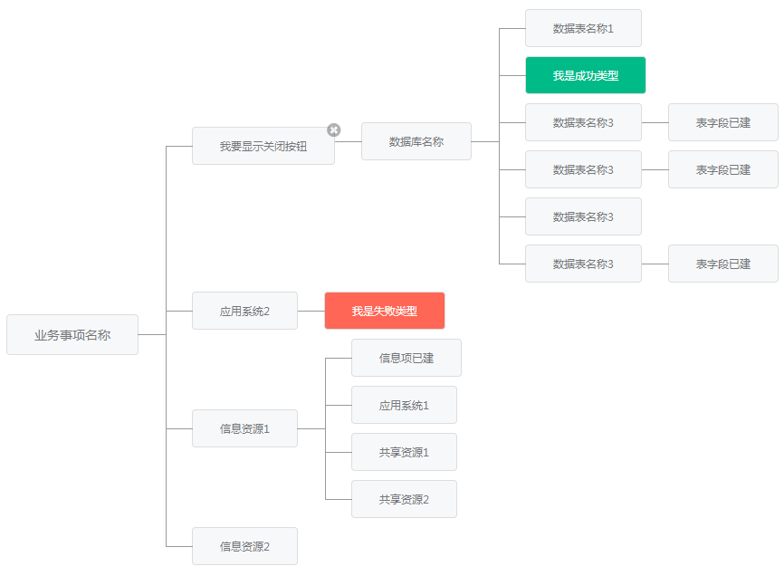

# 拓扑图



## 安装

````
yarn add @share/topology-jquery
// or
npm install @share/topology-jquery --save
````

或者到gitlab地址中下载：http://192.168.0.62:88/components/topology-jquery/tree/master/dist

## 使用

````
// css
<script src="/path/to/@share/topology-jquery/dist/topology.css"></script>

// js
<script src="/path/to/@share/topology-jquery/dist/topology.js"></script>

// 使用
$('#topology').topology({
    data: [...],
    setType: (item) => item.type,
    setClassName: item => 'customClassName',
    showCloseBtn: item => item.label === '我要显示关闭按钮',
    onClose: (item, data, elem) => {
        console.info(item);
        console.info(data);
        console.info(elem);
    }
});
````

查看示例：

````
git clone [本项目gitlab地址]
yarn
npm start
````

### 简单示例

````
$('#topology').topology({
    data: [
        {
            label: '业务事项名称',
            children: [
                {
                    label: '我要显示关闭按钮'
                }
            ]
        }
    ],
    setType: (item) => item.type,
    setClassName: item => 'customClassName',
    showCloseBtn: item => item.label === '我要显示关闭按钮',
    closeTitle: '删除',
    onClose: (item, data, e) => {
        console.info(item);
        console.info(data);
        console.info(e);
    },
    onClick: (item, data, e) => {
        console.info(item);
        console.info(data);
        console.info(e);
    },
    onAdd: (item, callback, e) => {
        console.info('点击的数据：', item);
        // 获取到数据后调用callback
        callback([
            {
                label: '新增的节点1'
            },
            {
                label: '新增的节点2'
            }
        ])
    }
});
````

### 自定义渲染项

````
$('#topology-custom').topology({
    data: [
        {
            label: '业务事项名称',
            children: [
                {
                    label: '我要显示关闭按钮',
                    children: [
                        {
                            label: '数据库名称',
                            children: [
                                {
                                    label: '数据表名称1'
                                },
                                {
                                    label: '我是成功类型',
                                    type: 'success'
                                },
                                {
                                    label: '数据表名称3',
                                    children: [
                                        {
                                            label: '表字段已建'
                                        }
                                    ]
                                },
                                {
                                    label: '数据表名称3',
                                    children: [
                                        {
                                            label: '表字段已建'
                                        }
                                    ]
                                },
                                {
                                    label: '数据表名称3'
                                },
                                {
                                    label: '数据表名称3',
                                    children: [
                                        {
                                            label: '表字段已建'
                                        }
                                    ]
                                }
                            ]
                        }
                    ]
                },
                {
                    label: '应用系统2',
                    children: [
                        {
                            label: '我是失败类型',
                            type: 'error'
                        }
                    ]
                },
                {
                    label: '信息资源1',
                    children: [
                        {
                            label: '信息项已建'
                        },
                        {
                            label: '应用系统1'
                        },
                        {
                            label: '共享资源1'
                        },
                        {
                            label: '共享资源2'
                        }
                    ]
                },
                {
                    label: '信息资源2'
                }
            ]
        }
    ],
    renderLabel: item => `自定义：${item.label}`
});
````

## API 

name | type | default | description
--- | --- | --- | --- |
data | array | [] | 数据源，包含label、value、children等字段
onClick | function | - | 点击回调事件，参数：当前点击项的数据；所有数据；点击的事件对象
cursor | one of: `default`、`pointer` | 'default' | 鼠标手型：包含默认、手型
renderLabel | function | - | 自定义渲染项，参数为item
setType | function | - | 增加样式类型，包含：error、success，其他请自己用样式增加
setClassName | function | - | 增加自定义类名，参数为item
showCloseBtn | function or boolean | false | 是否显示关闭按钮，支持bool或func类型
onClose | function | - | 点击关闭按钮的回调函数，参数：当前点击项的数据；所有数据；点击的事件对象
closeTitle | string | '关闭' | 关闭按钮提示文字
collapsedTitle | string | '收起' | 收起按钮的提示文字
expandedTitle | string or function | `item => item.children && item.children.length > 0 ? '展开' : '添加节点'` | 展开/添加按钮的提示问题，如果是function，参数为item

## 注意事项

### 关于背景色

由于实现时有些线我们使用白色覆盖造成线条假象，所以如果你用的地方背景不是白色，请覆盖样式：

````
.ui-topology .item:first-child:before{
    background: #ff6600!important; // 这里是你背景的颜色
}
.ui-topology .item:last-child:after{
    background: #ff6600!important; // 这里是你背景的颜色
}
````

## 问题或建议

http://192.168.0.62:88/components/topology-jquery/issues

## 更新日志

[更新日志](./CHANGELOG.md)
